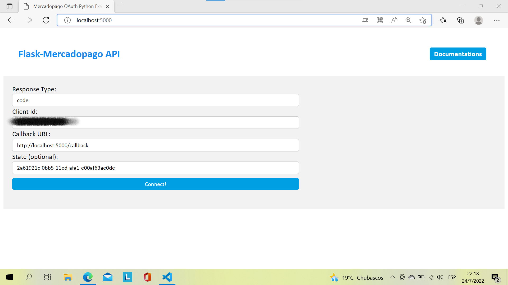
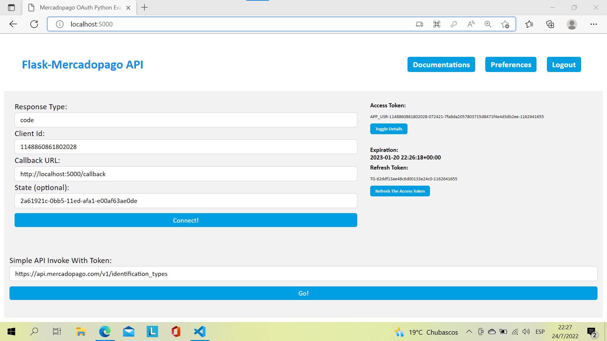

Sample app
============

Recommended running instructions:
~~~~~~~~~~~~~~~~~~~~~~~~~~~~~~~~~

1. Create a virtual environment:

.. code-block::
    
    $> python3 -m venv venv
    

2. Activate the newly created environment on macOS and Linux:

.. code-block::
    
    $> source venv/bin/activate
    
   
On Windows

.. code-block::

   c:\> .\env\Scripts\activate

3. Install dependencies:

.. code-block::

    $> (venv) python -m pip install -r requirements.txt

4. Start the sample app on server locally:

.. code-block::

    $> (venv) python app.py

  
You will get a form like this:

    

When the validation, the response data will be rendered with proper style:

